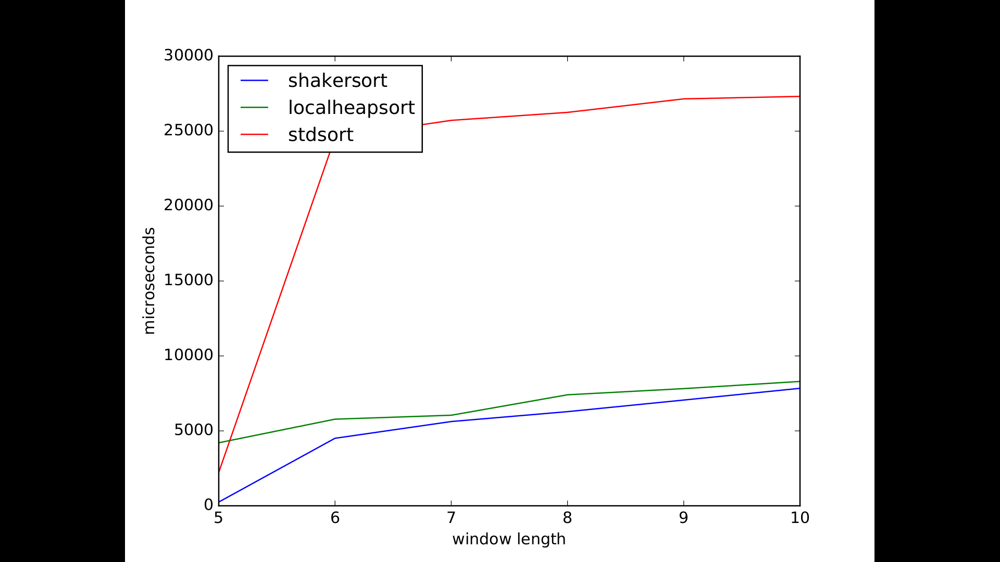

# sorting

This library provides a variety of sorting algorithms. It has no dependencies other than C++17 and CMake 3.15. The cmake script provides install target as well, but it is better to just clone it and add as subdirectory.

# Theory

## Ordering

Sorting is about transforming input arrays (further will be named ranges) to follow some order. In standard library, sorting requires strict partial order. 

## Problem of rabbits and turtles

This problem is primarily related to Bubble Sort. The basic idea of Bubble Sort is that it can take one largest element to the correct place in one full pass. These elements are called rabbits because they can reach their correct position relatively quickly. This means that elements which are to the *right* of their sorted position (in a range 9 11 22 81 3, value 3 would be to the right of its sorted position) will reach their correct position in multiple full passes, even if there are no other elements to swap. These elements are called turtles, because they move so slowly. There are several extensions of Bubble Sort algorithm which attempt to deal with this problem.

## Partitioning

Partitioning is an action of dividing elements into two groups: ones that satisfy a criterion and ones that don't. In case of sorting, it is usually used to put elements that are less than *pivot element* to the left, and those that are not less to the right. Notice that if partition is executed for each element, the range will be sorted. Now, it is not a good idea to do it for each element, as that will yield quadratic complexity in runtime. To do less partitioning, it is very important to choose correct pivot element. There are multiple heuristics to choose pivot elements, but none guarantee the best performance in all cases and none are guaranteed to prevent from descending into quadratic complexity in runtime, though most of them are good enough if protection from DDoS attacks or such is not a requirement.

# List of sorting algorithms:

## Simple algorithms:

The following algorithms all have quadratic complexity in runtime and constant complexity memory needs.

1. Insertion sort

Ideal for small ranges.

2. Selection sort

One of the least useful of the rest in this category.

3. Bubble sort

The other least useful algorithm, though has good extensions.

4. Cocktail-shaker sort

Very useful when range is "binned" into unsorted sequences and each element has very low distance to each sorted position. Please read [this post](https://codereview.stackexchange.com/a/160146/93301) for the peculiarities of the algorithm. TL;DR is that as long as bin is very small, this is probably the best algorithm to use. This algorithm solves Turtles and Rabbits problem by having one rabbit in each direction in one pass.

Here is the benchmark out of context:

5. Comb sort

This sorting algorithm solves Turtles and Rabbits problem by comparing non-consecutive elements instead of consecutive ones. This allows turtles to get catapulted very close to their correct position.

## Quick sort:

The primary parameter that governs the performance of QuickSort is pivot selection strategy.

1. First, last, N-th element as pivot element

This strategy is only suggested when distribution (shape of the range) is known and can be guaranteed, otherwise it quickly turns into very slow algorithm.

2. Median of three

Choose between first, last and middle element. Sort them and choose middle element. Although relatively robust, it still has killer sequences.

3. Random selection

Russian roulette. On each partition depth.

## Heap sort:

For this algorithm, a max-heap is built. Max heaps are complete binary trees where each child is lower or equal to parent. Note that instead of using separate data structure/storage, the tree is built inside range. The traversing goes like this: for each element under index i, elements under indices 2 * (i + 1) - 1 and 2 * (i + 1) will be its left and right children respectively. The sequence of plus/minus ones are that way to fix off-by-one errors. To build the heap, instead of going top-down, e.g. building the root first and then leaves at the end, bottom-up construction treats indices `n / 2 + 1` to `n` as leaf positions, and builds up from there by doing sift down on each index from `n / 2` to `0`. Sift down checks if property of heap at current node is maintained, and if not swaps the current element with greatest of its children. To finally sort the range, one has to continuously pop the heap, which is done by swapping the root with last element, and moving last element to its correct position in a now contracted heap (size decreases by one). This way, max elements are continously filled from right to left, thus establishing sorted range. For a better explanation, please watch this [MIT lecture](https://youtu.be/B7hVxCmfPtM?list=PLUl4u3cNGP61Oq3tWYp6V_F-5jb5L2iHb).